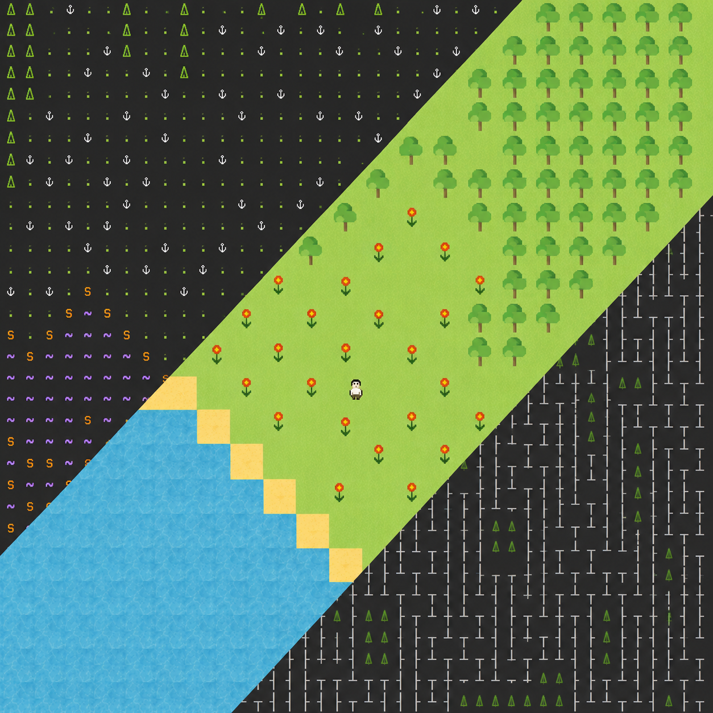

# Wave-pet 🗺️

`wave-pet` is a tile-based implementation of the Wave Function Collapse (WFC)
algorithm in Python featuring several (3️⃣) frontend apps.


## Key feature ⭐

The project focuses not only on the `WFC` algorithm, but also on well-thought-out architecture.
The goal was to implement a core structure that does not depend on any frontend logic.

This separates backend and frontend implementations, which makes it especially
easy to create apps using different technologies and frameworks.

As a result, the project has an abstract implementation (`abc_wfc`) and three
rendering apps, which implement **only the UI** logic.

## Tile rules ➗🟰✖️

Base tile has 4 directions: `UP 🔼`, `LEFT ◀️`, `DOWN 🔽`, `RIGHT ▶️`,
in which defines allowed neighboring tiles.

- Text tiles (`tile_packs/text`) also have **symbol** and **styling** fields (e.g., "⍋", "green underline").
- Tkinter tiles (`tile_packs/image`) have a corresponding **image** to it.
  

You can choose which tile pack to choose in each program (Locate `PACKS` variable in the `main.py` file).

Default name for ruleset file is `ruleset.json`, which must be in the tile pack directory.

## Apps 📱

- ️`Console app` - simple WFC output in console.


- `Textual WFC` - Terminal app, that allows user to change size of the board and manually collapse cells.


- `Tkinter app` - Desktop app that can generate an images based on WFC algorithm (that's sick).


## Installation & Running ▶️
### Installation ⚙️
```bash
git clone https://github.com/jopiks-s/wave-pet.git
cd wave-pet
python -m venv venv
venv\Scripts\activate
pip install -r requirements.txt
```
### Running
⚠️ Make sure to run console apps in **terminal**,
otherwise some features may not be available
Console output:
```bash
python -m text_wfc.main
python -m tui_wfc.main
python -m tk_wfc.main.py
```

## Project structure 🏗️
```text
> abc_wfc/       Base WFC algorithm and abstract tile contracts
> tile_packs/    Tile packs for WFC algorithm
> text_wfc/      Console/rich output application
> tui_wfc/       Textual terminal application
> tk_wfc/        Tkinter desktop application
```